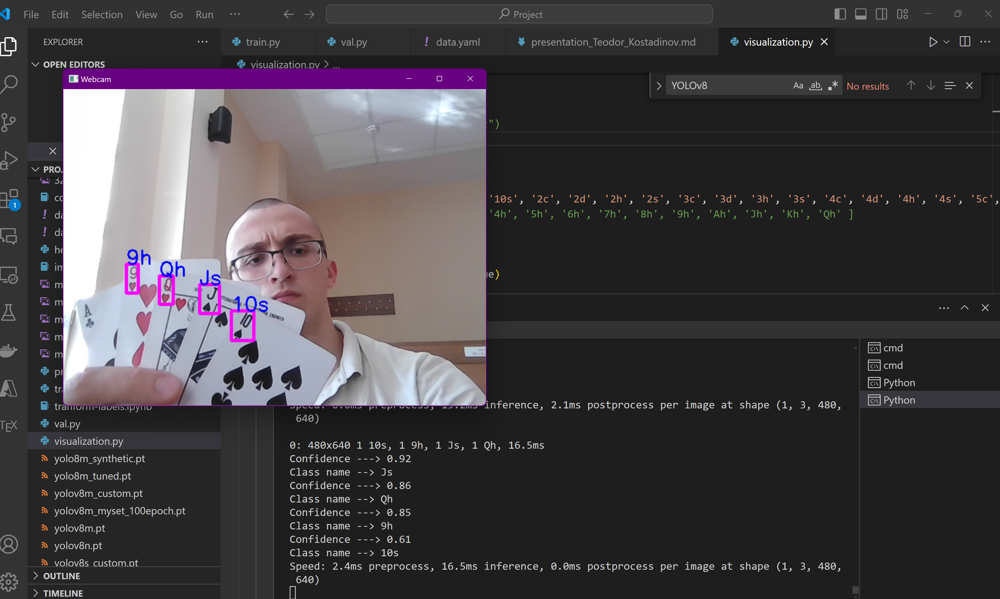
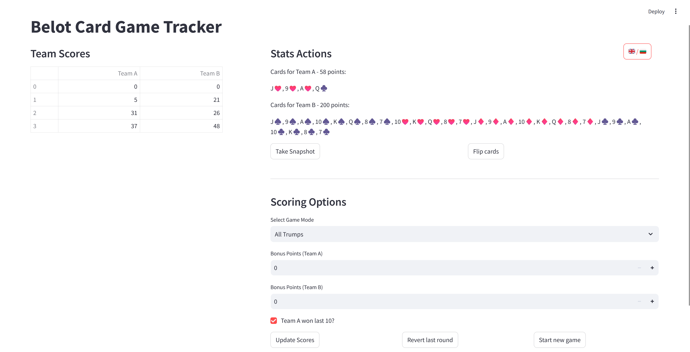
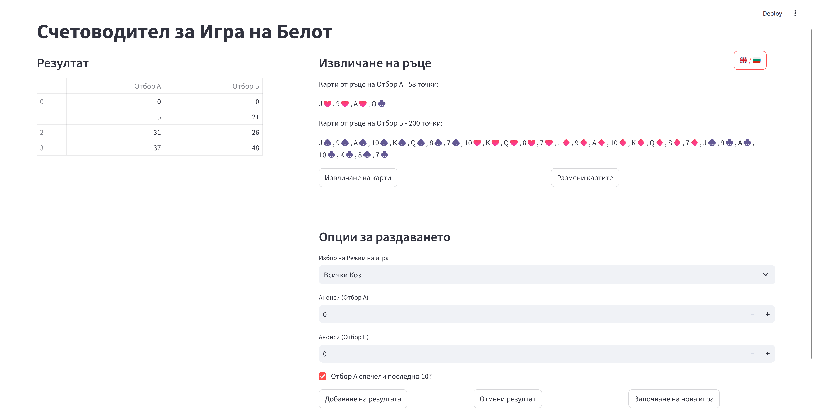

# Playing-Cards-Object-Detection

This repository encapsulates the whole process of training and evaluating various YOLOv8 models for playing cards object detection, including datasets, code for training, utility functions, presentations and research paper materials, the model themselves and live demo application with the best models.

## Datasets

All playing cards datasets used during the training of the models are available in the [data](./data) directory.
All datasets are in YOLOv8 object detection format, split on *train, valid and test* directories with *labels* and *images* subdirectories.
All of them fall under the [CC0: Public Domain](https://creativecommons.org/publicdomain/zero/1.0/) license.

### The Synthetic dataset

- Copied from [Kaggle - Playing Cards Object Detection Dataset](https://www.kaggle.com/datasets/andy8744/playing-cards-object-detection-dataset)
- Includes 20 000 images synthetically generated and labeled imaged with 52 classes.
- Used to train the *YOLOv8m_synthetic* model.

### The "Real" dataset

- Created by the author of the project - Teodor Kostadinov
- Includes 100 images shot and labelled by the author using [Label Studio](https://labelstud.io/) with 13 classes.
- Used to train the *YOLOv8m_real* and *YOLOv8m_tuned* model.

### The "Real" Augmented dataset

- Created using [imgaug](https://imgaug.readthedocs.io/en/latest/) with the script [augment_dataset.ipynb](./dataset_utils/augment_dataset.ipynb) 
- Introduces 10 augmented images for each image in the "Real" dataset using different transformations.
- Used to train the *YOLOv8m_aug* model.

### The Combined dataset

- Created using [imgaug](https://imgaug.readthedocs.io/en/latest/) with the scripts [combine_datasets.py](./dataset_utils/combine_datasets.py) and [transform_labels_in_dataset.py](./dataset_utils/transform_labels_in_dateset.py)
- Combines the full "Real" Dataset with 10 times more than it taken from the Synthetic dataset.
- Used to train the *YOLOv8m_comb* model.

#### Notes

- To use the datasets, one may need to replace the relative paths provided in the `data.yaml` file.
- The provided `test.yaml` files have the same structure as the `data.yaml` ones but are used to execute the model on the test set. This is done by replacing the path to the validation set with the path to the test set.
- All model runs has old project structure datasets path in the *args* configuration file.

## Models

Within the [runs](./runs) directory, you'll find all the data extracted from the training process of each model. The whole process of training, validating and testing the models is executed using the scripts in [model_utils](./model_utils/).

The table summarizes the models, datasets, epochs, and training times on *NVIDIA RTX A2000 8GB*:

| Model                                         | Dataset                      | Epochs | Training Time |
| --------------------------------------------- | ---------------------------- | ------ | ------------- |
| [YOLOv8m_synthetic](./runs/YOLOv8m_synthetic) | 20,000 synthetic images      | 10     | 2 hours       |
| [YOLOv8m_real](./runs/YOLOv8m_real)           | 100 real images              | 100    | 20 minutes    |
| [YOLOv8m_aug](./runs/YOLOv8m_aug)             | 1,000 augmented images       | 100    | 40 minutes    |
| [YOLOv8m_comb](./runs/YOLOv8m_comb)           | 100 real + 1,000 synthetic   | 100    | 50 minutes    |
| [YOLOv8m_tuned](./runs/YOLOv8m_tuned)         | 100 real images (fine-tuned) | 100    | 10 minutes    |

The best models are presented as pretrained files in the directory [final_models](./final_models). They are extracted from each models `train/weights/best.pt` to be used in the live demo application.

## Live demo application

The live demo application integrates the best performing models to detect the cards using the machine web cam.

To run the application create an environment using:
```bash
python -m venv env
```

Then install all requirements specified in the *requirements.txt* file using.:
```bash
pip install -r requirements.txt
```

Some of these requirements are required for running the utility functions and not just the application.

Note that to use CUDA after installing it, check your version using:

```bash
nvcc --version
```

Then proceed to download the [correct pytorch version](https://pytorch.org/get-started/locally/) e.g.:

```bash
pip uninstall torch   
pip3 install torch torchvision torchaudio --index-url https://download.pytorch.org/whl/cu124
```

This should enable CUDA.

```python
import torch
torch.cuda.is_available()
```

---

There are two models that the application can use - *YOLOv8m_synthetic* and *YOLOv8m_tuned*. Run the program specifying the model using:
```bash
python demo_application/model_visualization.py <synthetic_or_tuned>
```

Alternatively use your IDE GUI to start the application. The app will use a default value for the model parameter

To quit the program press `q` on your keyboard, to toggle confidence label press `s`.

View of the model predictions:



### Belot scoremanager

Or run the Streamlit application that helps you track your Belot game score:

```bash
streamlit run demo_application/main.py
```

View of the English version:


And the Bulgarian one:


## Presentations and research paper

The *presentations* folder consists of all materials required for creating and managing the presentations and research paper, including markdown, latex and media files.

The [final presentation](./presentations/presentation_final/presentation.pdf) includes detailed information, extracted metrics and test images. 

The main points are available in the [research paper](./presentations/research_paper/playing_cards_object_detection_yolov8.pdf) as well.