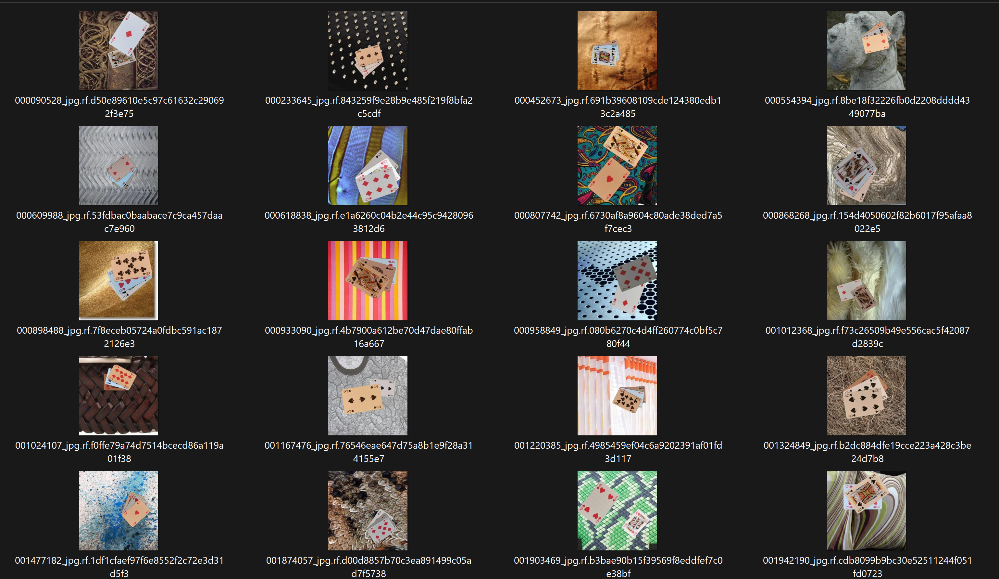
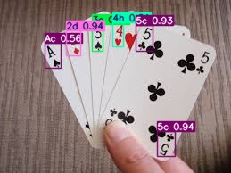
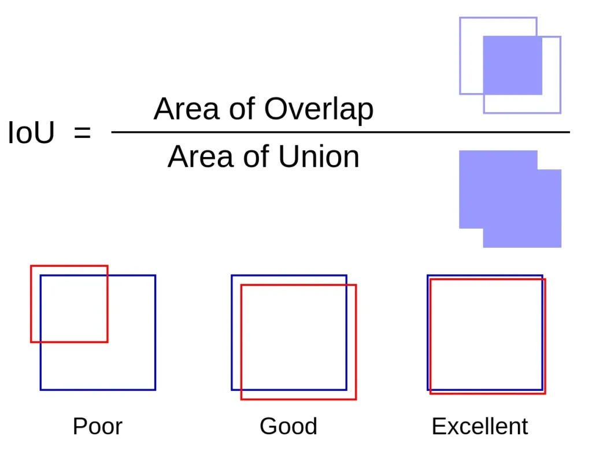
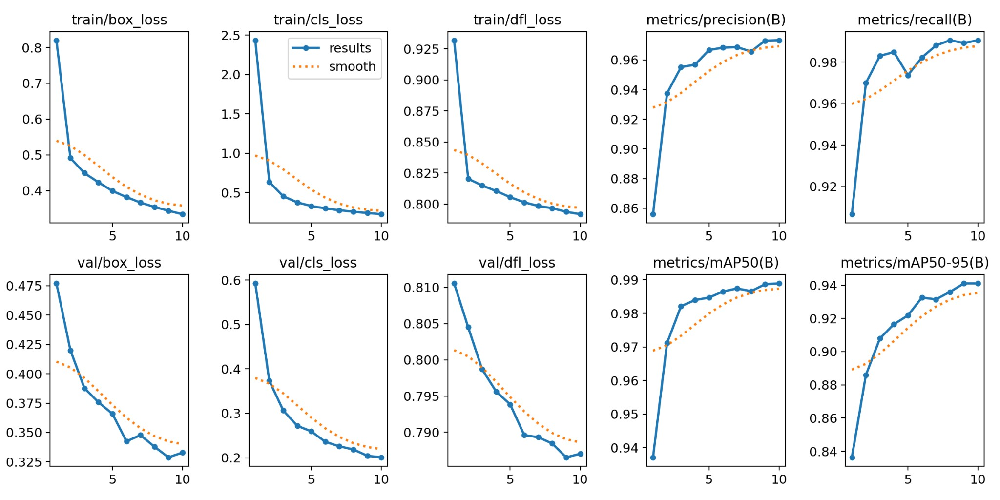
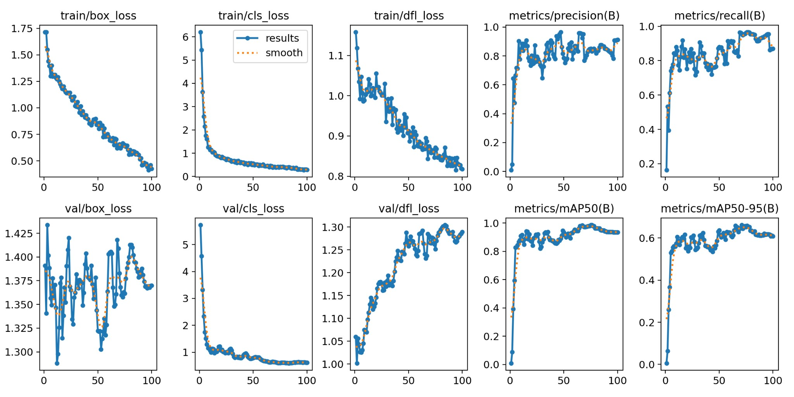
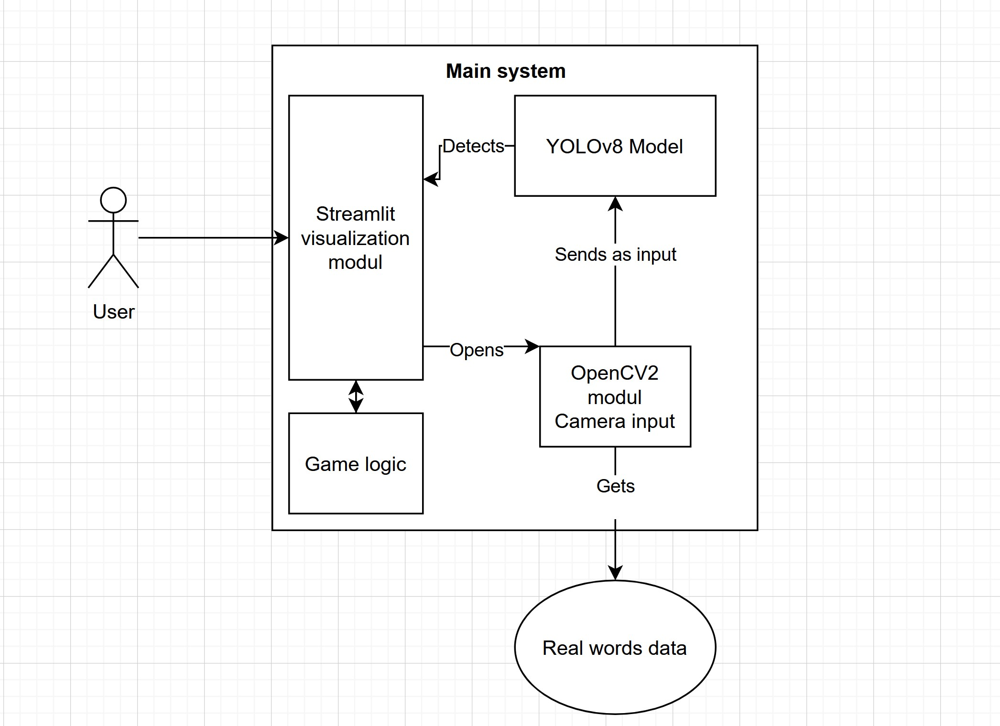

# Счетоводител за Белот 
Теодор Костадинов, 4MI0600097,
Факултет по Математика и информатика, Софийски университет

---

# Въведение

**Създаване на апликация** от край до край, който да **помага** точкуването на раздавания при играта Белот с помощта на **изкуствен интелект**.

---

# Тренировъчните данни

- **Готов *Kaggle* сет** от данни със 20 000 **синтетично** генерирани снимки, съдържащи 1, 2 или 3 снимки на разнообразен фон.
- **Личен** сет от 100 снимки, **аугментирани** до 1000 на брой.

---
# Тренировъчните данни

---
# Тренировъчните данни

**Всяка снимкa** в **отделен файл** има координатите на **долен-ляв** и **горен-десен** ъгъл на всяка една карта, включително и **класа на картата** (боя и ранг).

  
---

# Основен модел

- Използва **YOLOv8 medium** с 10 епохи.  
- Обучен с **20 000 изображения**, разделени 70/20/10 и 52 класа.  
- **2 часа време за обучение** на NVIDIA RTX A2000 8GB Laptop GPU.  
- Може да разпознава всяка карта от тестовия набор с **~99%** точност.  

---

# Метрики

- **Precision**: Дял на **верните** положителни предсказания спрямо **всички положителни**.
- **Recall**: Дял на **истинските** обекти, правилно разпознати от модела.

- *mAP (Mean Average Precision)* чрез **IoU (Intersection over Union)**

---

# Основен Модел метрики

Добро представяне по-всички параметри:

---
# На практика...

---
# "Подобрен" Модел

- Трениран с личния сет от данни **върху вече готовия** "Основен" модел.
- **С цел** да се **подобри и разшири** познанието на базовия модел.

---

# "Подобрен" Модел метрики

Колебливо представяне:

---

# Архитектура на приложението

- Графичен интерфейс - ***Streamlit***
- Камера и обработка - ***OpenCV***
- Логика на играта - *Python*
- Модел за разпознаване - ***YOLOv8***

---

# Live Demo

---
# Бъдещо развитие

- Разпознаване на **други видове карти** по дизайн
- Добавяне на **екстри** в приложението
- Пускане на **пазара**
- Развиване на **друга система за казина** с добитите знания
---

# Извод

**Възможно е** създавеното на приложение от **"край до край"** с вграден изкуствен ителект и модерен интерфейс **при ограничени ресурси**!