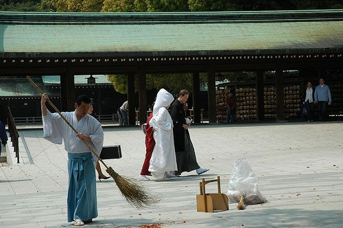
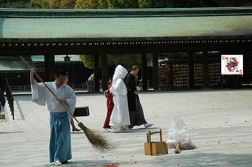
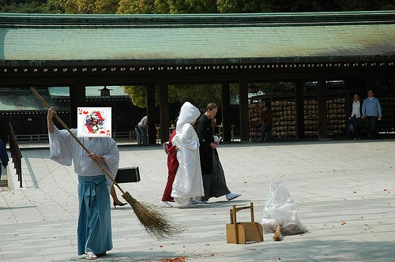
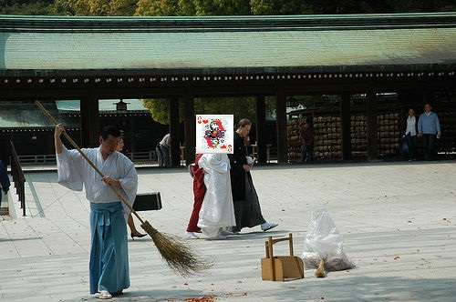
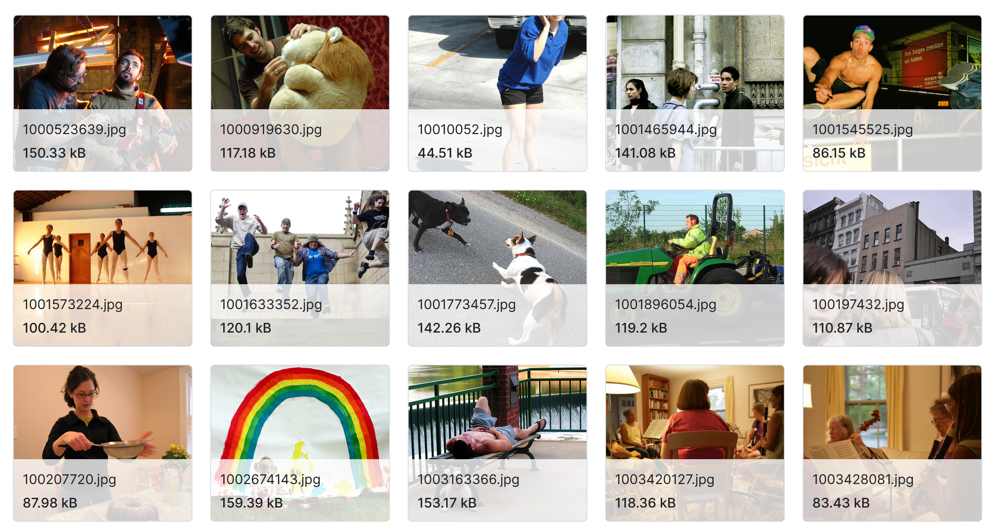

# Find and classify the hidden playing card during image captioning - combining two models.

Deep Learning project

---
# Team
Antonio Georgiev, 0MI0600089
Bojidar Goranov, 0MI0600022
Teodor Kostadinov, 4MI0600097
 

---

# Scrapped ideas

1. [Connect 4 competing](https://www.kaggle.com/competitions/connectx/overview) model with Python code - **dynamically competing** with all other models in Kaggle.
2. [Monet painting generation](https://www.kaggle.com/competitions/gan-getting-started/overview) - **generate** a painting **in Monet** style Kaggle competition.
3. Whale sounds to type - classification, what type is the whale **by the sound**.
---

# Idea

The purpose of this project is to attempt combining **two pre trained** models - a card **classification model** and an **image captioning model**. The expected result is to have a model that can **both find** and **identify the card** on an photograph showing wide variety of scenes.

---

# Card classification model
- [Cards Image Dataset-Classification](https://www.kaggle.com/datasets/gpiosenka/cards-image-datasetclassification/data) in Kaggle
- Use a pre-trained **CNN** model.

---
# Image captioning model
- [Flickr Image dataset](https://www.kaggle.com/datasets/hsankesara/flickr-image-dataset) in Kaggle
- Use a pre-trained **CNN** model.

---
# Data

Combining the two datasets - **enormous** number of possible input files.

- **7624** cards training images
- **31783** Flickr images

---

---

---

---

---

---

# Technologies
- Python
- PyTorch
- CNN
- Pre-trained models

---

# Difficulties

- Creating and labeling the input data.
- Defining the exact output format that we want.
- Training the model to search for the picture of a card.

---
# Relevant papers
- [Beyond a Pre-Trained Object Detector: Cross-Modal Textual and Visual Context for Image Captioning](https://openaccess.thecvf.com/content/CVPR2022/papers/Kuo_Beyond_a_Pre-Trained_Object_Detector_Cross-Modal_Textual_and_Visual_Context_CVPR_2022_paper.pdf)
- [IMAGE CAPTION GENERATOR USING CONVOLUTIONAL NEURAL NETWORKS AND LONG SHORT-TERM MEMORY](https://www.researchgate.net/profile/Jameer-Kotwal/publication/377852268_IMAGE_CAPTION_GENERATOR_USING_CONVOLUTIONAL_NEURAL_NETWORKS_AND_LONG_SHORT-TERM_MEMORY/links/65bb6cdb1e1ec12eff684fd8/IMAGE-CAPTION-GENERATOR-USING-CONVOLUTIONAL-NEURAL-NETWORKS-AND-LONG-SHORT-TERM-MEMORY.pdf)
- [Reusing Pretrained Models by Multi-linear Operators for Efficient Training](https://proceedings.neurips.cc/paper_files/paper/2023/file/09d9a13f7018110cfb439c06b07940a2-Paper-Conference.pdf)

---
# Thank you!
